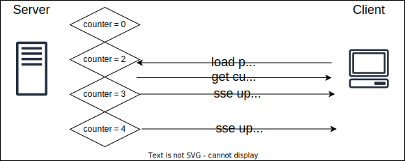
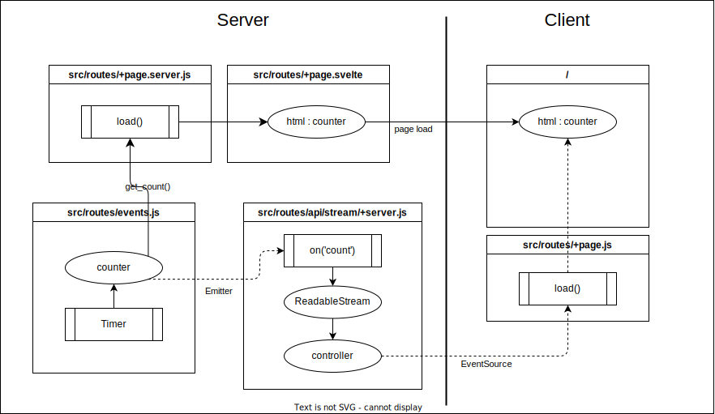

# 05_sse-counter

SSE: Server Sent Events. global var using a timer and Emitter.

Server keeps couter state. Reloading the page has no effect on the counter states which just keeps counting independently.

This example is using both load functions on server and on client.

* Notes

requires Node18 Node18 for ReadableStream()

not serverless compatible

* Sequence

* Project files

