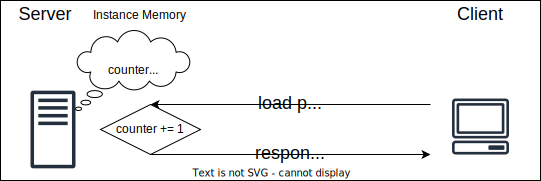

# svelte-examples
examples with svelte

supported auto deployments
* Cloudflare Pages
* Netlify
* Vercel
* Azure Static Web Apps

adapters
* adapter-static
* adapter-node
* adapter-netlify
* adapter-cloudflare
* adapter-cloudflare-workers
* adapter-vercel

community (deno, github, do, bun)

# 01_basics

basic example with home server rendered page and a prerendered page

live demo : https://svelte-basics.netlify.app/

# 02_ssr-counter

global server counter, keep state on page reload as long as the same instance is running. All clients will increment the same counter.

* Project files

* Dataflow

live demo : https://svelte-ssr-counter.netlify.app/

# 03_server-cookie-counter

couter saved as a cookie, fetched, incremented and updated by the server

live demo : https://svelte-cookie-counter.netlify.app/

# 04_client-counters

classical front end Cards counters. Each Card has a counter variable, all client side, resets on page reload

live demo : https://svelte-client-counters.netlify.app/

